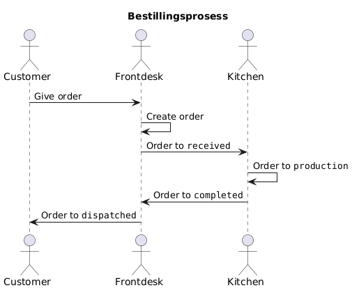
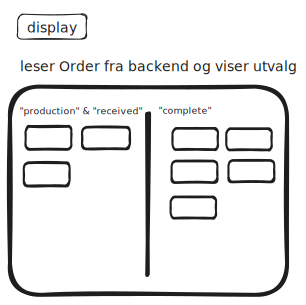

# Arkitektur

Bestillinger (orders) er hoveddelen av programvaren. De har fire states, som representeres deres livssyklus. Vi kan se på dette som en [tilstandsmaskin](https://en.wikipedia.org/wiki/Finite-state_machine):

Tjenester kommuniserer ikke direkte med hverandre. De sender en melding til backend. Andre tjenester lytter til visse kanaler hos backend. Når det er en oppdatering de er interessert i får de den. Generelt sett vil ikke andre tjenester lytte direkte til backend, vi isolerer mye av den logikken under `$lib/stores`. I prinsipp er dette relativt enkel implementasjon av en [event-drevet arkitektur](https://en.wikipedia.org/wiki/Event-driven_architecture).

For eksempel vil den store skjermen med hvilke bestillinger som er på vei ikke ha noe logikk selv. Den henter alt fra `$stores/orders`.

## Gloser

- Kaffebase. Vårt backend og persistens. Dette er en Elixir/Phoenix-applikasjon med SQLite som tilbyr API-er og sanntid gjennom Phoenix-kanaler.
- [Svelte](https://svelte.dev/). Et frontendrammeverk.
- [Sveltekit](https://svelte.dev/docs/kit/introduction). Ymse verktøy for Svelte, blant annet routing og muligheten for server-side kode.
- [Coolify](https://coolify.io/). Det vi bruker til å kjøre SvelteKit, frontendapplikasjonen.
- [fly.io](https://fly.io). Drifter Kaffebase-backenden.
- [Docker](https://www.docker.com). Lettvektscontainere som virker likt i alle miljø.

Vi har stores som er for det meste real-time subscriptions i mot Kaffebase. Disse lar resten av applikasjonen skrive til, gjennom et fast grensesnitt, og lytte til websockets levert av Phoenix. Dette gjør at applikasjonen oppleves som realtime, samtidig lagres alle endringer som gjøres mot persistenslaget.

Resten av interaksjon for å hente og skrive data gjøres gjennom kontraktslaget i `$lib/api/contracts` (eksponert gjennom domenetypene i `$lib/types`) som i dag fungerer som et typed lag mot Kaffebase sitt API på `PUBLIC_BACKEND_URL`. Autorisering håndteres av backenden.

## Red flags ⛳️

Kodebasen beveger seg fort og vi gjør mange ting OK+ til "vi fikser det etterpå".

Designsystemet er ikke gjennomtenkt.
